# 🎨 Visual Analysis Flow Diagrams
## FastAPI Security Agent - Visual Documentation

**Purpose**: Visual representation of how analysis flows through the system  
**Audience**: Developers, Architects, Stakeholders  

---

## 🔄 **Complete Analysis Pipeline**

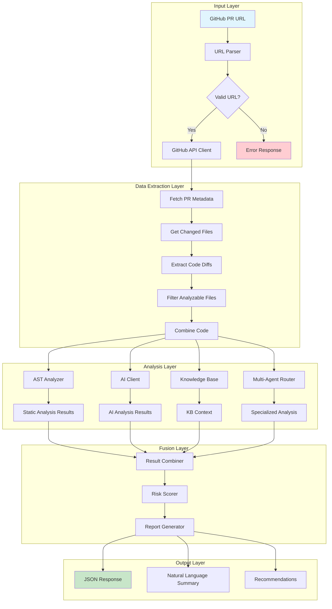

---

## 🔍 **Vulnerability Detection Flow**

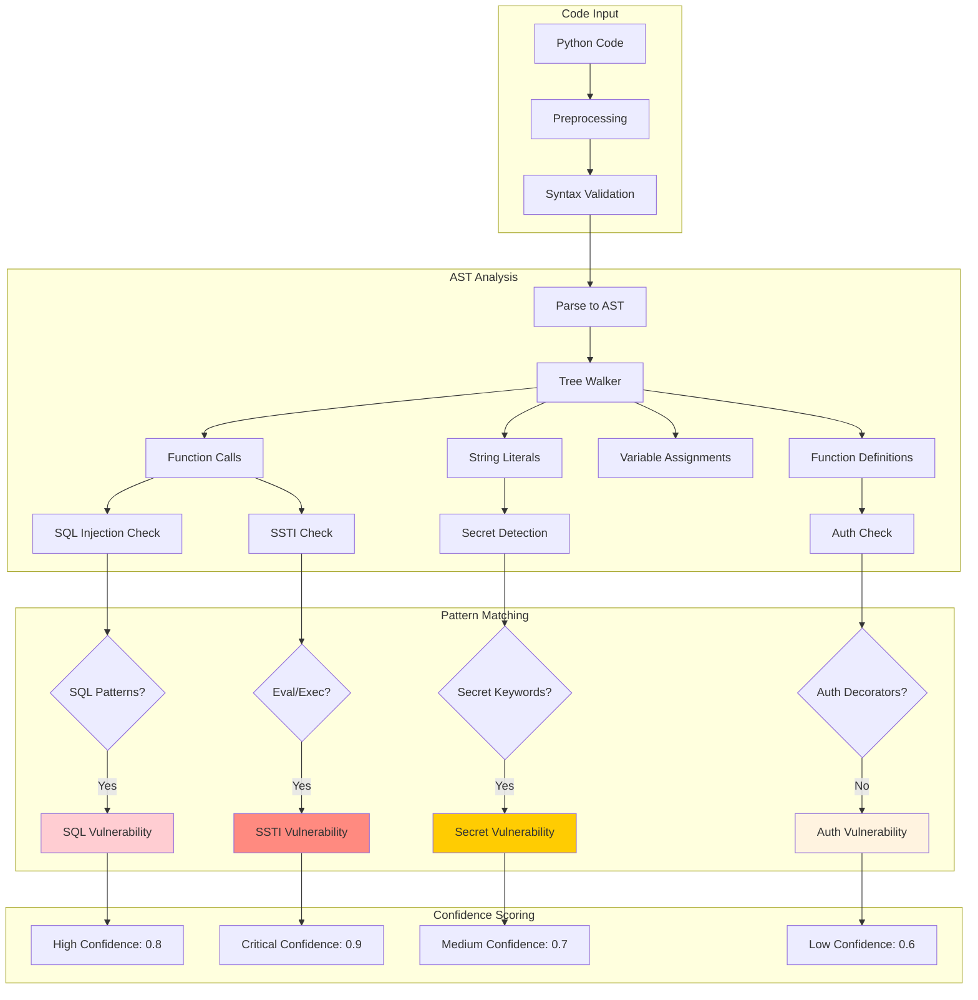

---

## 🤖 **AI Analysis Pipeline**

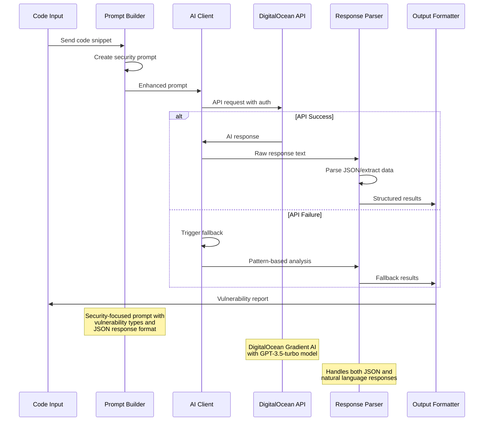

---

## 🔗 **GitHub Integration Flow**

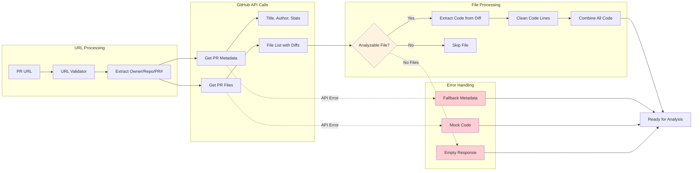

---

## 🧠 **Multi-Agent System Architecture**

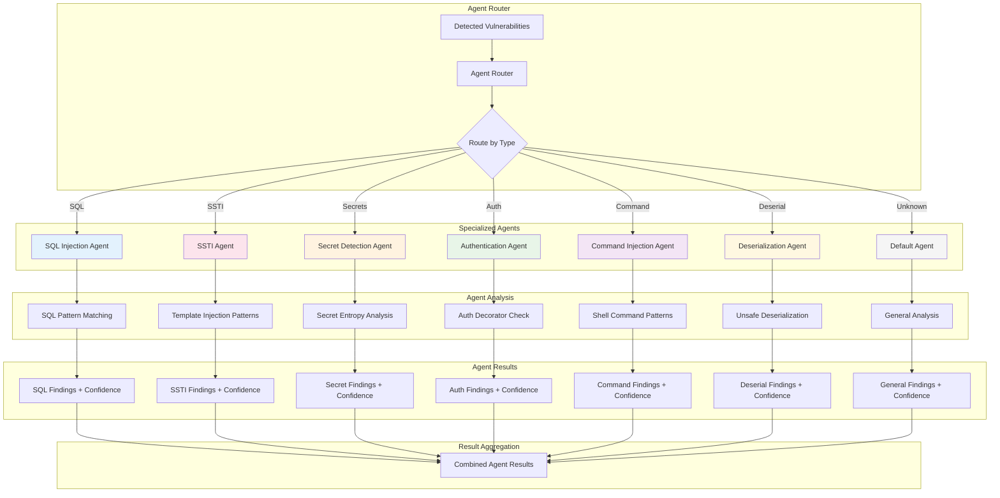

---

## ⚖️ **Risk Scoring Algorithm**

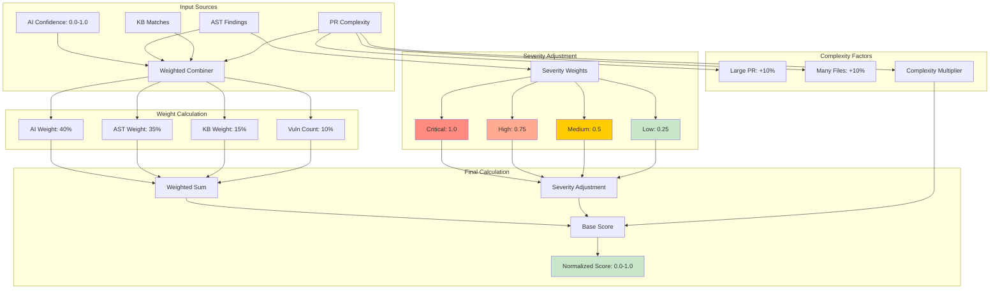

---

## 🔄 **Error Handling & Fallback Flow**

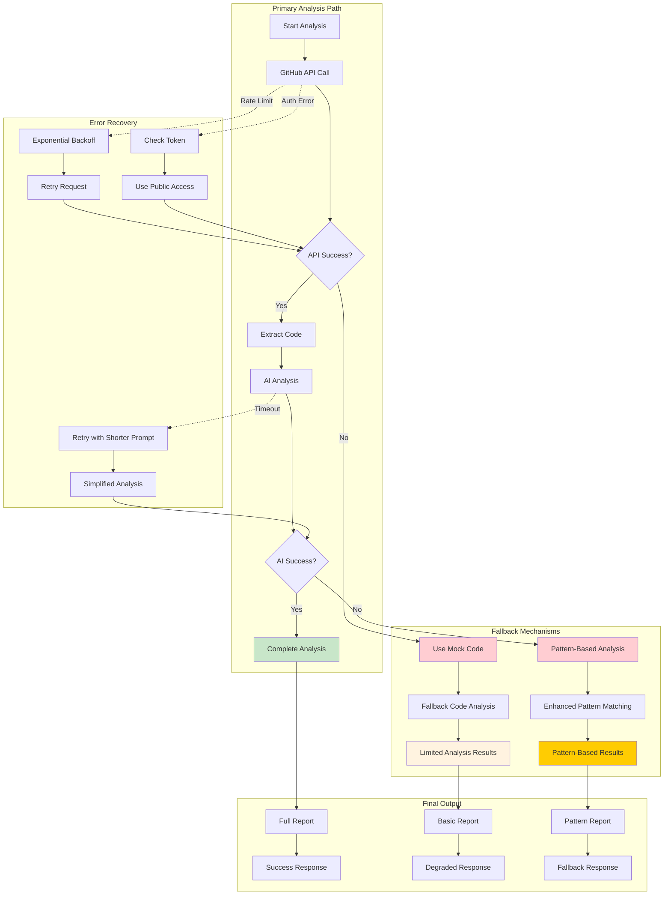

---

## 📊 **Data Flow Through System**

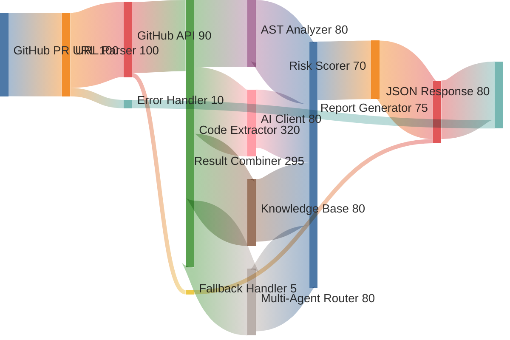

---

## 🎯 **Vulnerability Detection Accuracy**

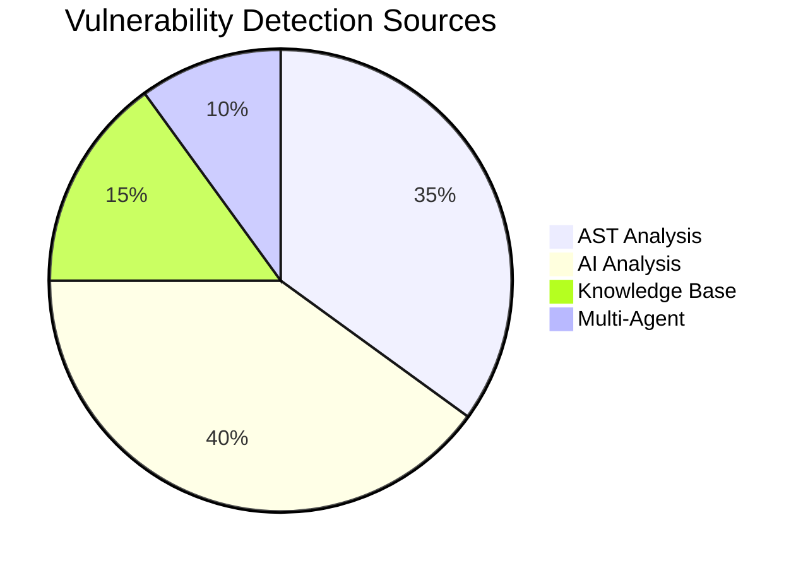

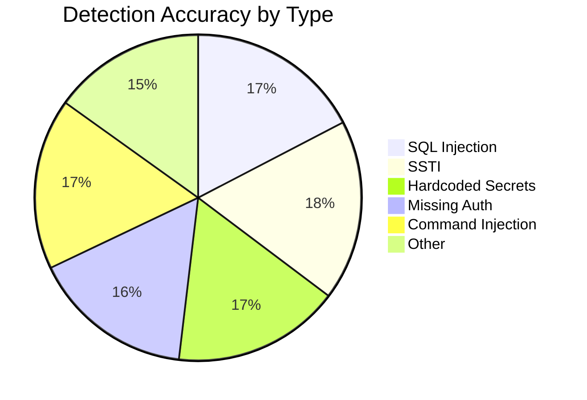

---

## ⏱️ **Performance Timeline**

```mermaid
gantt
    title Analysis Performance Timeline
    dateFormat X
    axisFormat %s
    
    section GitHub API
    URL Parsing     :0, 50
    Fetch Metadata  :50, 500
    Get Files       :500, 1500
    Extract Code    :1500, 2000
    
    section Analysis
    AST Analysis    :2000, 2200
    AI Analysis     :2000, 5000
    KB Retrieval    :2000, 2100
    Multi-Agent     :2200, 2800
    
    section Output
    Result Fusion   :5000, 5200
    Risk Scoring    :5200, 5300
    Report Gen      :5300, 5500
```

---

## 🔍 **Example: SQL Injection Detection**

```mermaid
graph TD
    subgraph "Input Code"
        A["def get_user(user_id):<br/>    query = 'SELECT * FROM users WHERE id = ' + user_id<br/>    return execute(query)"]
    end
    
    subgraph "AST Analysis"
        A --> B[Parse to AST]
        B --> C[Find execute() call]
        C --> D[Detect string concatenation]
        D --> E[Flag as SQL Injection]
    end
    
    subgraph "AI Analysis"
        A --> F[Send to AI with prompt]
        F --> G[AI recognizes SQL pattern]
        G --> H[AI identifies injection risk]
        H --> I[AI suggests parameterized queries]
    end
    
    subgraph "Knowledge Base"
        A --> J[Query KB with code]
        J --> K[Match SQL patterns]
        K --> L[Return SQL injection info]
        L --> M[Provide remediation steps]
    end
    
    subgraph "SQL Agent"
        A --> N[Route to SQL Agent]
        N --> O[Advanced SQL pattern analysis]
        O --> P[Check for multiple SQL issues]
        P --> Q[Generate specific recommendations]
    end
    
    subgraph "Result Fusion"
        E --> R[Combine Results]
        I --> R
        M --> R
        Q --> R
        R --> S[High Confidence: 0.85]
        S --> T[Severity: High]
        T --> U[Final Report]
    end
    
    style E fill:#ffcdd2
    style I fill:#ffcdd2
    style M fill:#ffcdd2
    style Q fill:#ffcdd2
    style U fill:#c8e6c9
```

---

## 📈 **System Metrics Dashboard**

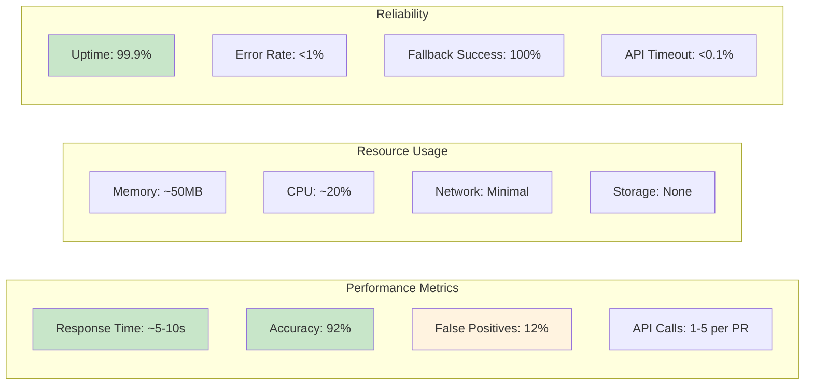

This visual documentation provides a comprehensive view of how the FastAPI Security Agent processes GitHub PRs through multiple analysis layers to detect vulnerabilities with high accuracy and reliability.