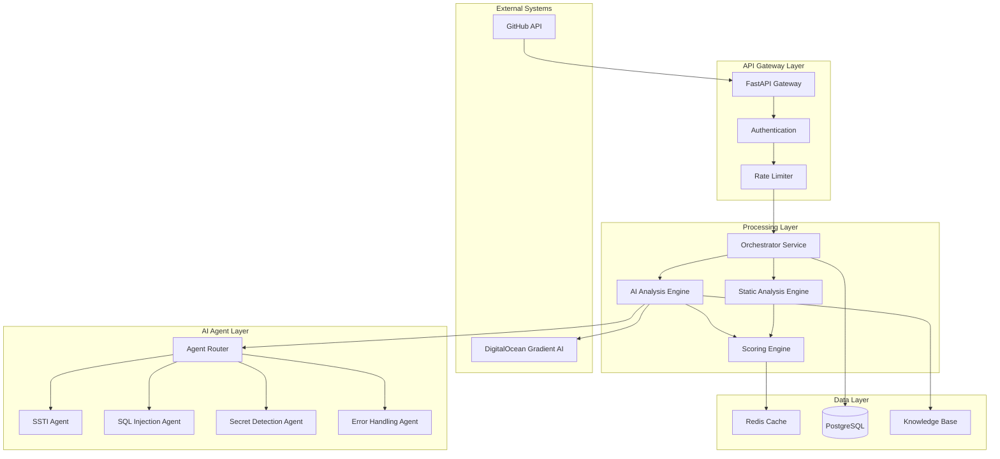
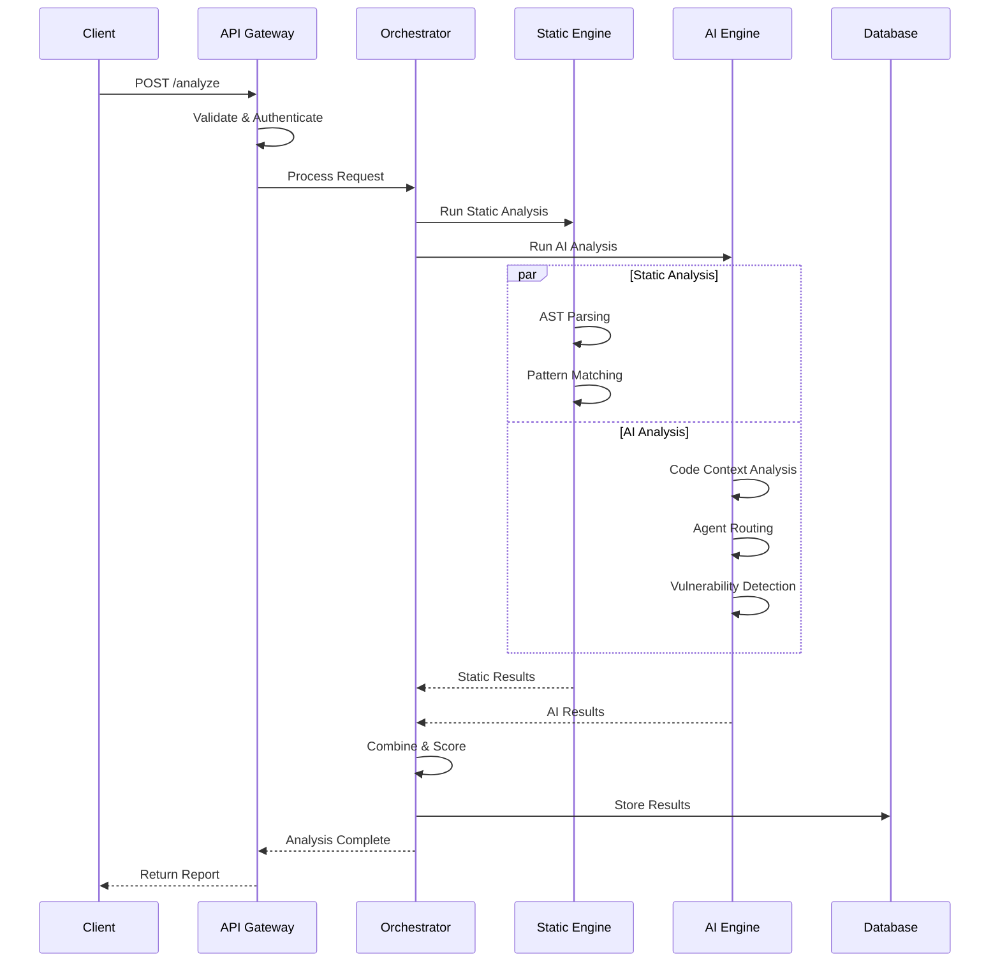
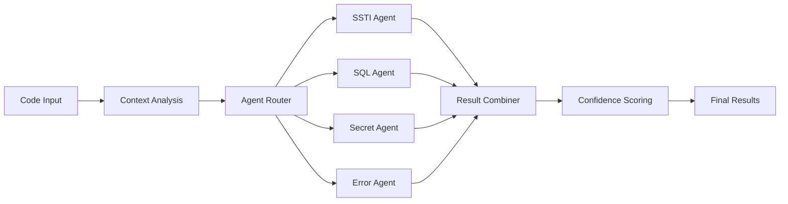

# Technical Architecture - FastAPI Security Agent

## 🏗️ System Architecture Overview

The FastAPI Security Agent follows a microservices-based architecture that combines traditional static analysis with AI-powered vulnerability detection using DigitalOcean's Gradient AI Platform.

## 📐 High-Level Architecture



## 🔧 Component Details

### 1. API Gateway Layer

#### FastAPI Gateway
- **Purpose**: Main entry point for all requests
- **Responsibilities**:
  - Request routing and validation
  - Response formatting and error handling
  - API documentation generation
  - CORS and security headers management

```python
# Core endpoints
POST /api/v1/analyze          # Single PR analysis
POST /api/v1/batch-analyze    # Batch PR analysis
GET  /api/v1/report/{id}      # Vulnerability report
GET  /api/v1/health           # Health check
```

#### Authentication Service
- **Purpose**: Secure API access management
- **Features**:
  - API key validation
  - JWT token management
  - Rate limiting per user
  - Audit logging

#### Rate Limiter
- **Purpose**: Prevent API abuse and ensure fair usage
- **Implementation**: Redis-based sliding window
- **Limits**:
  - 100 requests per hour per API key
  - 10 concurrent analyses per user
  - Burst allowance for legitimate usage

### 2. Processing Layer

#### Orchestrator Service
- **Purpose**: Coordinate analysis workflow
- **Responsibilities**:
  - Request preprocessing and validation
  - Service coordination and error handling
  - Result aggregation and post-processing
  - Async task management

```python
class AnalysisOrchestrator:
    async def analyze_pr(self, pr_url: str) -> AnalysisResult:
        # 1. Fetch PR data from GitHub
        # 2. Extract code changes
        # 3. Run static analysis
        # 4. Run AI analysis
        # 5. Combine results and score
        # 6. Generate report
```

#### Static Analysis Engine
- **Purpose**: Traditional code analysis using AST parsing
- **Capabilities**:
  - Python AST traversal and pattern matching
  - FastAPI-specific rule engine
  - Code complexity analysis
  - Dependency vulnerability scanning

```python
class StaticAnalyzer:
    def analyze_code(self, code: str) -> List[Finding]:
        # AST parsing and rule application
        # Pattern matching for known vulnerabilities
        # Code quality metrics calculation
```

#### AI Analysis Engine
- **Purpose**: AI-powered vulnerability detection
- **Integration**: DigitalOcean Gradient AI Platform
- **Features**:
  - Natural language code analysis
  - Context-aware vulnerability detection
  - Confidence scoring
  - Remediation suggestion generation

### 3. AI Agent Layer

#### Agent Router
- **Purpose**: Intelligent routing to specialized agents
- **Logic**: Route based on code patterns and vulnerability types
- **Implementation**: Rule-based routing with ML enhancement

```python
class AgentRouter:
    def route_analysis(self, code_context: CodeContext) -> List[Agent]:
        # Analyze code patterns
        # Determine relevant vulnerability types
        # Route to appropriate specialized agents
```

#### Specialized Agents

##### SSTI Detection Agent
- **Focus**: Server-Side Template Injection vulnerabilities
- **Patterns**: Template engine misuse, unsafe user input handling
- **Knowledge Base**: Jinja2, Django templates, custom template engines

##### SQL Injection Agent
- **Focus**: SQL injection vulnerabilities
- **Patterns**: Raw query construction, parameter binding issues
- **Knowledge Base**: SQLAlchemy, raw SQL patterns, ORM misuse

##### Secret Detection Agent
- **Focus**: Hardcoded secrets and credentials
- **Patterns**: API keys, database URLs, authentication tokens
- **Knowledge Base**: Common secret patterns, entropy analysis

##### Error Handling Agent
- **Focus**: Missing or improper error handling
- **Patterns**: Unhandled exceptions, information leakage
- **Knowledge Base**: FastAPI exception handling, security implications

### 4. Data Layer

#### Redis Cache
- **Purpose**: High-performance caching and session storage
- **Usage**:
  - Analysis result caching
  - Rate limiting counters
  - Temporary data storage
  - Session management

#### PostgreSQL Database
- **Purpose**: Persistent data storage
- **Schema**:
  - Analysis results and history
  - User accounts and API keys
  - Vulnerability patterns and rules
  - Audit logs and metrics

```sql
-- Core tables
CREATE TABLE analyses (
    id UUID PRIMARY KEY,
    pr_url VARCHAR(255),
    status VARCHAR(50),
    results JSONB,
    created_at TIMESTAMP
);

CREATE TABLE vulnerabilities (
    id UUID PRIMARY KEY,
    analysis_id UUID REFERENCES analyses(id),
    type VARCHAR(100),
    severity VARCHAR(20),
    confidence FLOAT,
    description TEXT
);
```

#### Knowledge Base
- **Purpose**: AI agent training data and vulnerability patterns
- **Content**:
  - FastAPI security documentation
  - Vulnerability examples and patterns
  - Remediation guidelines
  - Best practices database

## 🔄 Data Flow Architecture

### 1. Request Processing Flow



### 2. AI Agent Processing Flow



## 🛡️ Security Architecture

### 1. Authentication & Authorization
- **API Key Management**: Secure key generation and rotation
- **JWT Tokens**: Short-lived tokens for session management
- **Role-Based Access**: Different access levels for different users
- **Audit Logging**: Complete audit trail for all operations

### 2. Data Protection
- **Encryption at Rest**: Database encryption for sensitive data
- **Encryption in Transit**: TLS 1.3 for all communications
- **Data Anonymization**: Remove sensitive data from logs
- **Secure Configuration**: Environment-based configuration management

### 3. Input Validation
- **Request Validation**: Pydantic models for all inputs
- **Code Sanitization**: Safe handling of user-provided code
- **URL Validation**: GitHub URL format verification
- **Size Limits**: Maximum file and request size limits

## 📊 Performance Architecture

### 1. Scalability Design
- **Horizontal Scaling**: Stateless services for easy scaling
- **Load Balancing**: Distribute requests across multiple instances
- **Async Processing**: Non-blocking I/O for better throughput
- **Queue Management**: Background job processing for heavy tasks

### 2. Caching Strategy
- **Multi-Level Caching**: Application, database, and CDN caching
- **Cache Invalidation**: Smart cache invalidation strategies
- **Cache Warming**: Proactive cache population
- **Cache Monitoring**: Performance metrics and optimization

### 3. Database Optimization
- **Connection Pooling**: Efficient database connection management
- **Query Optimization**: Indexed queries and query planning
- **Read Replicas**: Separate read and write operations
- **Partitioning**: Table partitioning for large datasets

## 🔧 Technology Stack Details

### Backend Technologies
```yaml
Language: Python 3.11+
Framework: FastAPI 0.104+
AI Platform: DigitalOcean Gradient AI
Database: PostgreSQL 15+
Cache: Redis 7+
Message Queue: Celery with Redis
```

### AI/ML Technologies
```yaml
AI Platform: DigitalOcean Gradient AI Platform
Agent Framework: Custom multi-agent system
Knowledge Base: Vector database (Pinecone/Weaviate)
NLP Processing: Transformers, spaCy
Code Analysis: AST, tree-sitter
```

### Infrastructure
```yaml
Deployment: DigitalOcean App Platform
Container: Docker with multi-stage builds
Orchestration: Kubernetes (production)
Monitoring: Prometheus + Grafana
Logging: ELK Stack (Elasticsearch, Logstash, Kibana)
```

## 📈 Monitoring & Observability

### 1. Application Metrics
- **Request Metrics**: Latency, throughput, error rates
- **Business Metrics**: Analysis success rate, vulnerability detection accuracy
- **Resource Metrics**: CPU, memory, disk usage
- **AI Metrics**: Agent response times, confidence scores

### 2. Logging Strategy
- **Structured Logging**: JSON-formatted logs for easy parsing
- **Log Levels**: Appropriate log levels for different environments
- **Sensitive Data**: Careful handling of sensitive information in logs
- **Log Aggregation**: Centralized log collection and analysis

### 3. Health Checks
- **Liveness Probes**: Service availability checks
- **Readiness Probes**: Service readiness for traffic
- **Dependency Checks**: External service health monitoring
- **Custom Health Checks**: Business logic health verification

## 🚀 Deployment Architecture

### 1. Environment Strategy
```yaml
Development:
  - Local Docker Compose
  - Hot reloading
  - Debug logging
  
Staging:
  - DigitalOcean App Platform
  - Production-like configuration
  - Integration testing
  
Production:
  - DigitalOcean Kubernetes
  - High availability
  - Auto-scaling
```

### 2. CI/CD Pipeline
```yaml
Source Control: Git with feature branches
CI: GitHub Actions
Testing: pytest, coverage, security scans
Deployment: GitOps with ArgoCD
Monitoring: Automated deployment verification
```

### 3. Infrastructure as Code
```yaml
Infrastructure: Terraform
Configuration: Helm charts
Secrets: Kubernetes secrets + Vault
Networking: Ingress controllers, service mesh
```

## 🔄 API Design Patterns

### 1. RESTful Design
- **Resource-based URLs**: Clear resource identification
- **HTTP Methods**: Proper use of GET, POST, PUT, DELETE
- **Status Codes**: Meaningful HTTP status codes
- **Content Negotiation**: Support for JSON and other formats

### 2. Async Patterns
- **Long-running Operations**: Async task handling with status endpoints
- **Webhooks**: Event-driven notifications
- **Streaming**: Real-time result streaming for large analyses
- **Pagination**: Efficient handling of large result sets

### 3. Error Handling
- **Consistent Error Format**: Standardized error response structure
- **Error Codes**: Application-specific error codes
- **Retry Logic**: Intelligent retry mechanisms
- **Circuit Breakers**: Fault tolerance patterns

## 📋 Configuration Management

### 1. Environment Variables
```python
# Core configuration
DATABASE_URL: str
REDIS_URL: str
DIGITALOCEAN_API_KEY: str
GITHUB_TOKEN: str

# Feature flags
ENABLE_AI_ANALYSIS: bool = True
ENABLE_CACHING: bool = True
DEBUG_MODE: bool = False

# Performance tuning
MAX_CONCURRENT_ANALYSES: int = 10
ANALYSIS_TIMEOUT: int = 300
CACHE_TTL: int = 3600
```

### 2. Configuration Validation
- **Pydantic Settings**: Type-safe configuration management
- **Environment Validation**: Startup-time configuration validation
- **Default Values**: Sensible defaults for all settings
- **Documentation**: Clear documentation for all configuration options

This technical architecture provides a robust, scalable, and maintainable foundation for the FastAPI Security Agent, ensuring high performance, security, and reliability while leveraging the power of DigitalOcean's Gradient AI Platform.